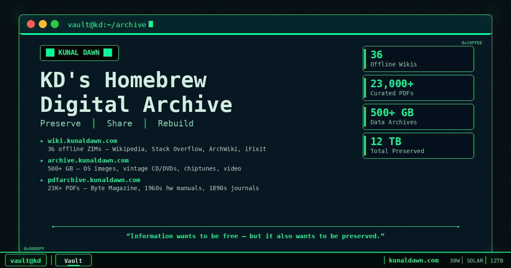

<div align="center">



</div>

# kunaldawn.com

Source code for **[kunaldawn.com](https://kunaldawn.com)** — the front door to *KD's Homebrew Digital Archive*.

> A home-grown mirror of the public internet — 12 TB of preserved knowledge.
> A shelf in a house, not a rack in a data centre.
> Fighting link rot, one `wget` at a time.

The site is a late-'90s desktop that boots inside your browser: a draggable-window
NFO world with a taskbar, a system tray, a cat living on the wallpaper, a tracker-music
player wired to a MilkDrop visualizer, and a demoscene engine humming in the background.
Behind it all, one small Go binary serves the whole thing and quietly keeps the archive honest.

## On the desktop

- **NFO-style window manager** — draggable, focusable windows; taskbar; Start menu; system tray.
- **Desktop cat** — a little state machine that wanders the wallpaper and celebrates visitor milestones.
- **Chiptune player** — `.mod` / `.xm` / `.it` tracker modules decoded in-browser via `libopenmpt`, with a real-time [Butterchurn](https://github.com/jberg/butterchurn) (MilkDrop) visualizer.
- **In-window browser** — open the sub-archives without leaving the desktop.
- **Demoscene engine** — because a homepage from 1998 deserves a backdrop that shows off.

## Under the hood

A single statically-linked Go binary ([`main.go`](main.go), [`status.go`](status.go)) — no framework, no build step for the front-end, just files on disk.

- **Static serving** of [`static/index.html`](static/index.html) (the entire desktop is one file) with CSP, security headers, rate limiting, and a non-root container.
- **Visit counter** that splits **human vs bot** by User-Agent server-side, so the number means something — `→ /api/visit`.
- **Archive health monitor** — periodic status probing with historical uptime tracking — `→ /api/status.json`, `/api/status/history.json`.
- **Playlist + click tracking** for the music and the sub-archive tiles — `→ /api/playlist`, `/api/archive-clicks`.
- **SQLite** (WAL mode, single writer) for the handful of counters worth keeping. No third-party analytics.

## The rig

[](static/infra.mp4)

Not a single box — a tiny home-grown archive in a home:

- **2× Raspberry Pi 4** (8 GB) for services and scraping, plus an **N150 mini-PC** for heavier indexing
- **4× 2 TB HDD + 2× 2 TB SSD** hot, **12 TB** external cold backup kept offline
- **~30 W** total draw — engineered to run off-grid on a modest solar rig
- No cloud, no CDN, no uptime guarantee. When the battery dies, the site goes with it.

## Run it

```bash
docker compose up --build      # serves on http://localhost:8888

# or straight from source (CGO required for sqlite3):
CGO_ENABLED=1 go run .         # PORT and DATA_DIR are configurable
go test ./...
```

## Stack

`Go 1.22` · `net/http` · `mattn/go-sqlite3` · vanilla JS · `libopenmpt` · Butterchurn · Docker (multi-stage, non-root)

---

```
  no ads · no monetization · free for all, free forever
              preservation doesn't require a data centre —
                 just determination, a shelf, and enough panels to cover the draw.
```
